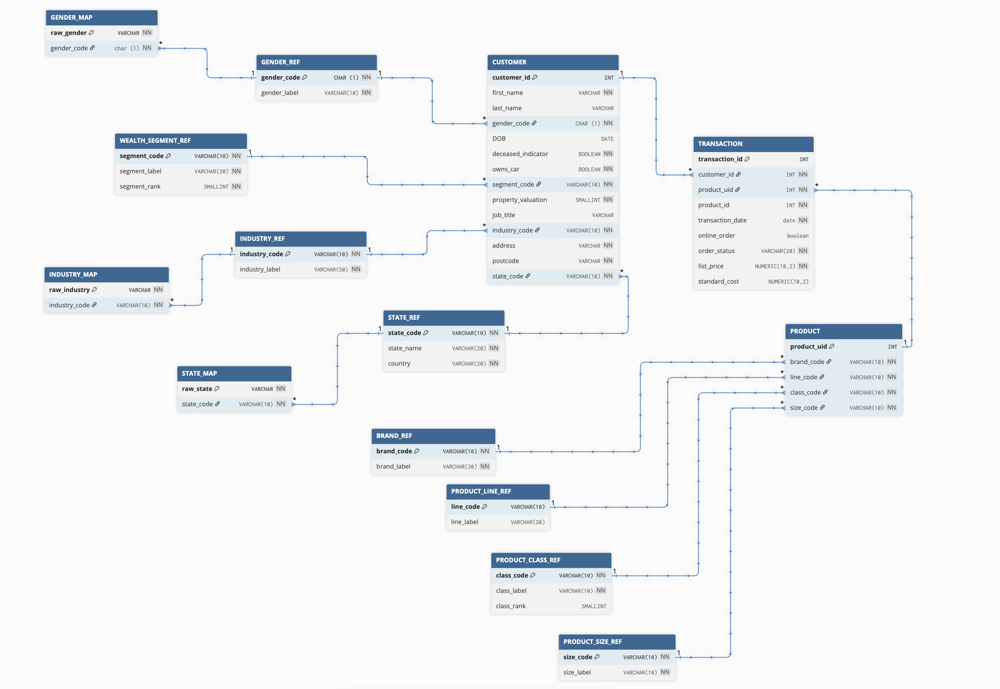

# Нормализация и построение базы данных клиентов и транзакций  
МФТИ · Домашнее задание №1 · Фрейдина А.И.

---

## 1. Цель работы

Целью проекта является построение корректной реляционной модели для данных о клиентах и их транзакциях, а также нормализация исходной таблицы до **третьей нормальной формы (3НФ)**.

В работе выполнено:

- анализ исходных данных (клиенты + транзакции);
- определение сущностей и функциональных зависимостей;
- нормализация (1НФ → 2НФ → 3НФ);
- построение ER-диаграммы;
- создание структуры в PostgreSQL (CREATE TABLE);
- создание справочников и таблиц отображения (mapping tables);
- загрузка данных, предварительная очистка и трансформация;
- проверка ссылочной целостности.

Все материалы размещены в данном репозитории.

---

## 2. Исходные данные

Исходный файл содержал два логических блока:

- **данные клиентов (customer sheet)**: сведения о ФИО, адресе, демографии, сегменте, профессии;  
- **данные транзакций (transaction sheet)**: сведения о покупках, товарах и стоимости.

Формально данные предоставлялись в виде двух больших таблиц без нормализации и без выделения сущностей.

Данные содержали:

- неравномерные категориальные значения (например, `F`, `Female`, `Femal`);
- опечатки: `Argiculture`;
- неполные записи (`NULL`, пустые строки);
- product_id нельзя трактовать как ключ, т.к. он не является уникальным продуктом — одно и то же product_id встречается в разных комбинациях параметров товара;
- смешение уровней детализации (товар полностью описан на уровне транзакции);
- product характеристики (brand, product_line, class, size) лежат в транзакции — повторяющаяся группа.

Эта структура является типичной для сырых “data lake” данных, но не подходит для реляционной базы данных.

---

## 3. Нормализация

## 3.1. Первая нормальная форма (1НФ)

Требования 1НФ:

1. Все значения — **атомарные**.  
2. В строках нет повторяющихся групп.  
3. Нет составных, вложенных структур.  
4. Все строки однородны.

### Было ли исходное состояние в 1НФ?

**Да, формально обе таблицы уже находились в 1НФ.**

Почему:

- все значения представлены скалярно: строка / число / дата;  
- нет многозначных атрибутов, нет списков;  
- gender, job_industry, state — хоть и грязные, но атомарные строки.

То, что значения неконсистентны (`F`, `Female`, `Femal`),  
**не нарушает 1НФ**, поскольку атомарность не страдает.

---

## 3.2. Вторая нормальная форма (2НФ)

Требования 2НФ:

- Таблица должна быть в 1НФ;  
- Все неключевые атрибуты должны **полностью зависеть от первичного ключа**, а не от части составного ключа.

### Проверки:

#### Транзакции  
В таблице транзакций есть атрибуты:

- product_id
- brand  
- product_line  
- product_class  
- product_size  

которые формально выглядят как кандидаты на новую сущность **product** с ключом **product_id**, однако **product_id** не является уникальным атрибутом (одному и тому же **product_id** соответствуют разные комбинации характеристик товара). 

Тогда можно сделать вывод, что все эти атрибуты зависят от единственного ключа **transaction_id**, а не от product_id → нет нарушения 2НФ.

#### Клиент  
В таблице клиентов единственный **простой первичный ключ - customer_id**  → нет нарушения 2НФ.

---

## 3.3. Третья нормальная форма (3НФ)

Требования 3НФ:

1. Таблица находится во 2НФ.  
2. Нет транзитивных зависимостей вида:  
   **ключ → атрибут → другой атрибут**

### Нарушения:

- state → country

То есть страна определяется через штат, а не напрямую через customer_id.  
Это классическое нарушение 3НФ.

(важно отметить, что для адресных атрибутов post_code, address никаких зависимостей нет: в исходных данных эти атрибуты и их комбинации однозначно не определяют state)

### Переход к 3НФ:

Эти зависимости вынесены в отдельные справочники:

- Создан справочник **STATE_REF(state_code, state_name, country)**  
- В таблицу customer теперь записывается только `state_code`
- country определяется по внешнему ключу

---

# 4. Обоснование сущностей и справочников

### Почему продукт — отдельная таблица?
Потому что комбинация (brand, line, class, size) определяет уникальный товар (был создан ключ product_uid).  
product_id в сырых данных **не отражает продукт**, а является произвольным идентификатором источника.

### Почему адрес НЕ выделен в отдельную сущность?

Потому что:

1. В данных нет ключа, который однозначно определял бы адрес (многие клиенты имеют одинаковые строки адресов).
2. Адрес не используется как отдельная бизнес-сущность в предметной области.
3. Адрес не имеет собственной семантики (нет здания, города, улицы — это просто строка).
4. Выделение адреса привело бы к усложнению без выигрыша в нормализации.

### Почему нужны mapping-таблицы и справочники?

Большая часть созданных справочников **не связана с нарушениями НФ**, а является:

- стандартизацией категориальных значений;
- устранением опечаток и разноформатных записей;
- построением корректных доменов;
- повышением качества модели данных;
- подготовкой структуры к аналитическим задачам.

#### Подробное обоснование каждого справочника

### GENDER_REF + GENDER_MAP

**Проблема:**  
В исходных данных встречались разные записи пола:  
`F`, `Female`, `Femal`, `M`, `Male`, `U`.

**Решение:**  
- GENDER_REF — унифицированный домен (`F`, `M`, `U`).
- GENDER_MAP — таблица соответствий “грязное → чистое”.

**Отношение к НФ:**  
Не связано с 1НФ–3НФ.  
Это — очистка данных и стандартизация признаков.

---

### INDUSTRY_REF + INDUSTRY_MAP

**Проблема:**  
Расхождения и опечатки в отраслях:  
`Health`, `Financial Services`, `Argiculture`, `NULL`, `n/a`.

**Решение:**  
- INDUSTRY_REF — стабильные коды отраслей.
- INDUSTRY_MAP — сопоставление сырых строк с кодами.

**Отношение к НФ:**  
Опять же, не нормализация, а Data Quality + Domain Modeling.

---

### WEALTH_SEGMENT_REF

**Проблема:**  
Только текстовые значения сегментов, без кодов и без возможности расширять атрибуты.

**Решение:**  
Таблица сегментов с кодами (`MASS`, `AFFL`, `HNW`) и ранжированием.

**Отношение к НФ:**  
Изначальная таблица customer не нарушала НФ.  
Справочник — улучшение модели.

---

### BRAND_REF / PRODUCT_LINE_REF / PRODUCT_CLASS_REF / PRODUCT_SIZE_REF

**Проблема:**

- категоризация продукта размазана по transactional таблице,
- строки повторяются тысячи раз,
- нет кодов и устойчивого домена,
- невозможно дополнять атрибуты (например, class_rank).

**Решение:**

Вынесение доменов продукта в отдельные справочники.

**Отношение к НФ:**

Это **не** исправление нарушения 2НФ или 3НФ.  
Transaction изначально зависела только от PK = transaction_id.

Созданы как:
- измерения (dimensions),
- оптимизация предметной области,
- устранение дублирования.

---

### PRODUCT (вынесение сущности товара)

**Проблема:**

Transaction хранила product-атрибуты в каждой строке:

- brand  
- line  
- class  
- size  
- list_price  
- standard_cost

Это ведёт к огромному дублированию.

**Решение:**

Создана отдельная сущность PRODUCT, на которую ссылаются транзакции.

**Отношение к НФ:**

Формально 3НФ не нарушалась (PK простой).  
Но это — сильное улучшение модели:  
предметно корректное выделение сущностей.

---

# 5. ER-диаграмма

Диаграмма расположена в папке `diagram/DB_diagram.png` и продублирована ниже:

---

# 6. SQL-структура базы данных

Полный SQL-код создания структуры лежит в файле: sql/create_script.sql
Там определены все таблицы:

- CUSTOMER
- PRODUCT
- TRANSACTION
- GENDER_REF / GENDER_MAP
- STATE_REF / STATE_MAP
- INDUSTRY_REF / INDUSTRY_MAP
- WEALTH_SEGMENT_REF
- PRODUCT_LINE_REF
- PRODUCT_CLASS_REF
- PRODUCT_SIZE_REF
- BRAND_REF

Каждая таблица включает:

- первичный ключ,
- внешние ключи,
- корректные типы данных,
- ограничения NOT NULL там, где это обосновано исходными данными.

# 7. Загрузка данных в PostgreSQL

Загрузка была выполнена в два этапа:

---

### **7.1. Этап 1 — загрузка сырых данных**

Через DBeaver Import Wizard:

- customer_rawс_data.csv → таблица customer_raw
- transaction_rawс_data.csv → таблица transaction_raw

---

### **7.2. Этап 2 — очистка и вставка в нормализованную модель**

Шаги:

1. Очистка значений `gender`, `industry`, `state` через MAP-таблицы  
2. Приведение дат, boolean-параметров  
3. Генерация уникальных комбинаций товаров → PRODUCT  
4. Вставка всех клиентов → CUSTOMER  
5. Вставка всех транзакций → TRANSACTION

Фактические результаты загрузки:

- СUSTOMER — 4000 строк  
- PRODUCT — 50 строк  
- TRANSACTION — 19997 строк

  
(3 строки были отброшены — customer_id отсутствовал в customer. На данном этапе можно было бы решить проблему, загрузив "нулевого" клиента в CUSTOMER, однако в реальных проектах это решение остается на усмотрение аналитиков)

---

# 8. Итоги работы

База данных полностью нормализована и приведена к строгой 3НФ.  
Созданы дополнительные справочники и map-таблицы для обеспечения:

- стандартизации категориальных полей,
- устранения опечаток и грязных значений,
- высокой читаемости и расширяемости модели,
- оптимальной структуры для аналитики.

Модель соответствует практикам построения Data Warehouse (dimension modeling), при том что сохраняет теоретическую чистоту реляционной нормализации.

